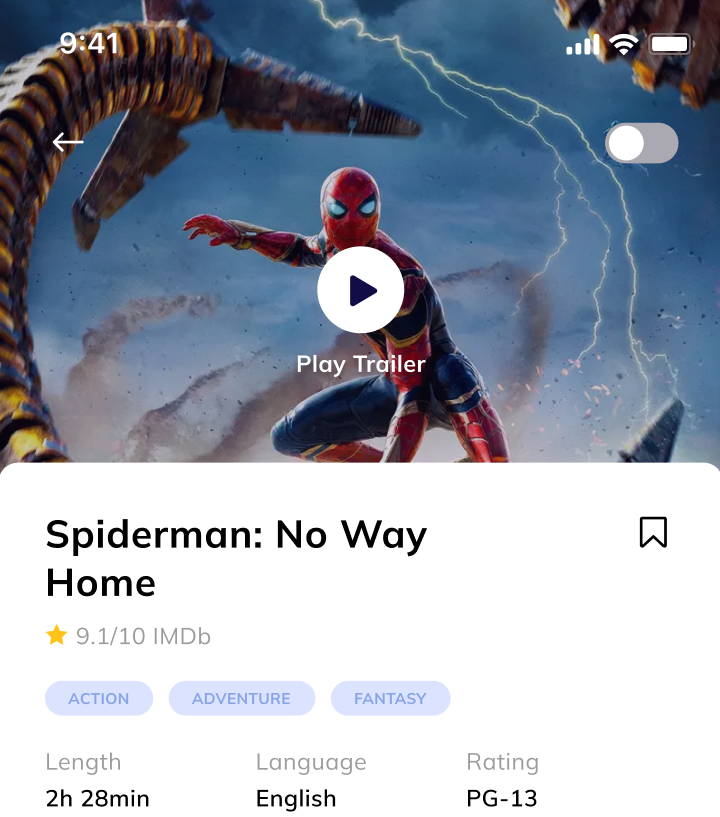

# Projekt: Moviez

I dette projekt skal du arbejde med at lave en mobil web-app, der viser film og serier.

Al data om filmene og serierne kommer fra en onlne database, der hedder TMDB - The Movie DataBase. Den svarer til IMDB, som du måske kender, men er gratis as benytte.

TMDB stiller et web-API til rådighed, som du først skal have adgang til. Denne adgang får du på

https://www.themoviedb.org/signup

APIets dokumentation kan du læse her:

https://developer.themoviedb.org/docs/getting-started

## Hvad skal der laves

Projektet er opdelt i 3 levels. Hver level stiger i sværhedsgrad, men hvis du løser projektet på level 1+2 så har du opfyldt fagenes mål.

Level 1+2 handler om at hente og sende data fra et API.

Level 3 handler om at styre et bruger-verifikations-flow og hvordan du kan "gemme" oplysninger om hvilkn bruger, der er logget ind fra view til view, eller over længere tid (fx 1 måned).

### Level 1

For at løse projektet på level 1 skal du:

* Lave en forside, der viser film som spiller i biografen og populære film.
* På forsiden skal man desuden have mulighed for at toggle light-/darkmode.
* Nå man klikker på en film på forsiden, bliver man ledt til en detaljeside, der viser detaljer om den film man har klikket på.
* Læg mærke til, at detaljesiden skal vise en video i toppen.

### Level 2

For at løse projektet på level 2 skal du:

* Lave en søgefunktion. Funktionen skal integreres i det øvrige design på en måde du selv finder hensigtsmæssig, men hvor du overholder app-ens øvrige designstil.
* Søgefunktionen skal virke til at søge blandt både film, TV-serier og personer.
* Søgeresultat vises på en side for sig.
* Brugere skal kunne klikke på både film, TV-serier og personer, for at blive ledt til deres respektive detaljesider. Det betyder, at der skal være en detaljeside for hver type resultat.

### Level 3

For at løse projektet på level 3 skal du:

* Lave en separat side, hvor brugere kan logge ind med deres egen TMDB konto.
* Brugere, der er logget ind, kan nu bogmærke film fra filmenes detaljesider.
* Brugere, der er logget ind, kan også fjerne bogmærker.
*Brugere kan få vist en ny side, hvor brugerens bogmærkede film vises.
* På Bogmærke-siden kan brugere også klikke sig hen på filmens detaljeside.

### Ekstraopgaven, hvis du har tid

Lav en funktion, så brugere, der er logget ind, kan lave lister over film og TV-serier. Brugere skal kunne oprette, se, tilføje til, slette fra, og omdøbe deres egne lister.

Brugere skal også kunne slette deres egne lister.

## Aflevering

Opgaven skal afleveres fredag d. 31 maj, i den tilstand I har nået.

## Tips

* Læs API dokumentationen grundigt. Der er også en god "Getting Started" sektion.
* Alle destruktive handlinger (slet en ting) bør blive bekræftet af brugeren af en ekstra prompt.
